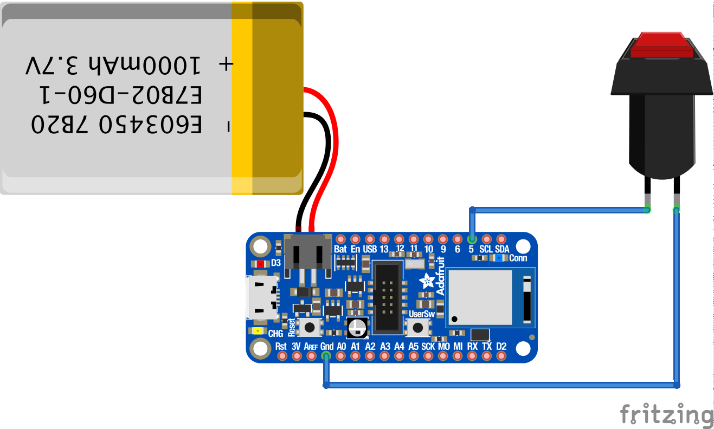

# zoomout
 a pull switch (or BYO button) that gets you out of video calls, quick.
 
 
 As seen on [Twitter](https://twitter.com/lanewinfield/status/1339257875034566656)
 
 ## System compatibility
 * Tested on macOS Catalina (10.15)
 * Ends Zoom + Google Meet calls (in Google Chrome)
 
 ## What is what?
 * `code.py` is the firmware for the Feather
 * `zoomout-alfred.alfredworkflow` is the Alfred Workflow to kill video chats
 * `zoomout.scpt` is the script that runs inside the Workflow (not needed if you use Alfred)
 * `zoomout-handle.stl` and `zoomout-mount` are the 3d print files for the handle and mount. (Also available to edit on Tinkercad [here](https://www.tinkercad.com/things/749yRW8q4SA) and [here](https://www.tinkercad.com/things/cFzmRNmvD24))
 
 ## Hardware
 ### Supplies
 * Adafruit Feather nRF52840 Express ([Adafruit](https://www.adafruit.com/product/4062))
 * Pull-Chain Switch ([Home Depot](https://www.homedepot.com/p/Gardner-Bender-3-Amp-Single-Pole-Single-Circuit-Pull-Chain-Switch-Brass-1-Pack-GSW-32/100124264?cm_mmc=ecc-_-THD_ORDER_CONFIRMATION_BOPIS-_-V1_M1_CA-_-Product_URL&ecc_ord=WM26797024), but you could get this tons of other places)
 * Beaded chain w/ connector ([Home Depot](https://www.homedepot.com/p/Commercial-Electric-3-ft-Polished-Brass-Beaded-Chain-with-Connector-82475/306596911?cm_mmc=ecc-_-THD_ORDER_CONFIRMATION_BOPIS-_-V1_M1_CA-_-Product_URL&ecc_ord=WM26797024), also available elsewhere)
 * Battery (optional, I used a 2000mAh battery, available on [Adafruit](https://www.adafruit.com/product/2011))
 * A 3D printer for parts
 ### Wiring
 Wire/solder one of the two cables on the pull switch to a Digital pin (I used #5) and the other to ground. It's that easy! (schematic below shows button because I couldn't find a pull-switch and I am lazy)
 
 
 ### Change to button
 Eschew the whole pull-chain thing and just replace it with a button, if you'd like. You can even leave your device plugged into USB that way if you'd like.
 
 ### Printing/building
 Print the 3d parts and put 'em together. Or just jury rig your own! The mount is designed specifically for the pull-chain switch I used. Make the slot larger or smaller based on your particular pull-chain switch. I superglued the chain right into the socket in the top of the handle. Mount the finished product preferably on a stud or use good anchors. You're gonna pull down pretty hard and you don't wanna pull out a piece of your wall. 
 
 ## Firmware
 My process for making this work was emulating a bluetooth keyboard and sending a specific key command (CMD+F6) to the computer, which was read and then executed an Applescript.
 
 To do that, I modified an Adafruit CircuitPython script to get this to happen. It'll pair with your computer and from that point forward, it will trigger CMD+F6.
 
 You can follow [all of these directions on Adafruit](https://learn.adafruit.com/ble-hid-keyboard-buttons-with-circuitpython/overview), then just replace the code with what's supplied and that should work!
 
 ## Software
 The software on the computer is a two layer process:
 
 * An AppleScript, which will kill all open video calls
 * Alfred, which will trigger the AppleScript using a hotkey sent from the hardware
 
 [Alfred](https://www.alfredapp.com/) is what I ended up using to trigger this. Why? It was easy to use. I had to upgrade to the Alfred Powerpack (£29) for this to work. The Workflow (complete with AppleScript within) is supplied.
 
 The AppleScript for the Workflow is also supplied separately, in case you wanna BYO. Essentially it finds all tabs on Chrome of instances of meet.google.com and kills them. And it manually exits any Zoom calls.

 ## Enjoy!